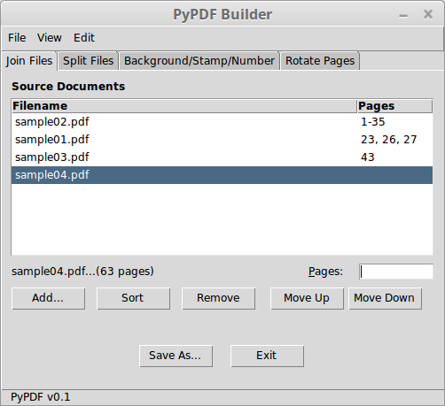

# PyPDF Builder

A cross-platform clone of [PDFTK Builder](http://angusj.com/pdftkb/) written in Python. Yes, Python!

The project's goal is a simple, end-user friendly GUI for the [PyPDF2](https://github.com/mstamy2/PyPDF2) package that can join, split, stamp/number, and rotate PDFs.



## Getting Started

Grab a copy of `virtualenv` or `virtualenvwrapper` and set up a virtual environment with your favorite Python interpreter (see [Prerequisites](#prerequisites)) to separate the dependencies for this project. Then it's the same old same old:

```
git clone https://github.com/mrgnth/PyPDF-Builder.git
pip install -r requirements
```

These instructions will get you a copy of the project up and running on your local machine for development ~~and testing~~ purposes. ~~See deployment for notes on how to deploy the project on a live system.~~

### Prerequisites

PyPDF Builder is built on [Tkinter](https://docs.python.org/3/library/tk.html), [Pygubu](https://github.com/alejandroautalan/pygubu) and [PyPDF2](https://github.com/mstamy2/PyPDF2), a pure-python PDF library. Running `pip freeze` should give you something like this:

```
pygubu==0.9.8.2
PyPDF2==1.26.0
```

Python 3.6 was used in development... I haven't checked for compatibility with lower versions, so your mileage my vary with anything starting 3.5 on downward.

## License

This project is licensed under the MIT License - see the [LICENSE](LICENSE) file for details

## Acknowledgments

* [Matthew Stamy](https://github.com/mstamy2): Creator and current maintainer of the PyPDF2 Python package

## To Do

- [X] Join Tab Functionality
- [X] Split Tab Functionality
- [ ] Refactor to avoid code repetition in save, file info, etc methods
- [ ] Documentation
- [ ] Write tests
- [ ] Error checking user input
- [ ] Error/Exception Handling
- [ ] Stamp/Background/Number Tab
- [ ] Rotate Pages
- [ ] Package via pyInstaller
- [ ] Distribution via Releases on GitHub
